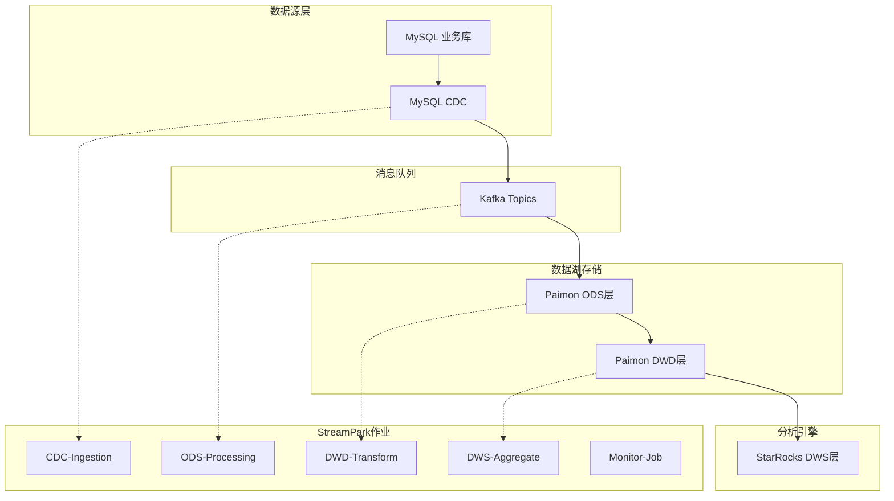

# 🏗️ StreamPark 实时数仓工程化项目

## 📋 项目概述

这是一个基于 **Apache StreamPark + Flink** 的企业级实时数仓解决方案，将原有的单体Flink SQL脚本进行工程化改造，实现：

- ✅ **作业解耦**: 5个独立作业，支持独立部署和扩缩容
- ✅ **配置管理**: 统一的环境配置，支持dev/test/prod多环境
- ✅ **监控告警**: 完整的监控体系和自动化告警机制  
- ✅ **数据治理**: 数据质量检查和血缘关系管理
- ✅ **运维自动化**: CI/CD集成和故障自动恢复

## 🎯 技术架构



## 📁 项目结构

```
streampark-realtime-dw/
├── streampark-jobs/                    # 作业SQL文件
│   ├── job-01-cdc-ingestion.sql       # CDC数据采集
│   ├── job-02-ods-processing.sql      # ODS层处理
│   ├── job-03-dwd-transform.sql       # DWD层转换
│   ├── job-04-dws-aggregate.sql       # DWS层聚合
│   └── job-05-monitor.sql             # 数据质量监控
│
├── streampark-config/                  # 配置文件
│   ├── application.yml                # 主配置文件
│   ├── application-dev.yml            # 开发环境配置
│   ├── application-test.yml           # 测试环境配置
│   └── application-prod.yml           # 生产环境配置
│
├── streampark-project/                 # 项目工程文件
│   ├── pom.xml                        # Maven依赖管理
│   ├── src/main/java/                 # Java代码(如需要)
│   ├── src/main/resources/            # 资源文件
│   └── src/test/                      # 测试代码
│
├── streampark-deployment/              # 部署相关
│   ├── deployment-guide.md            # 部署指南
│   ├── docker-compose.yml             # 本地环境
│   ├── kubernetes/                    # K8s部署文件
│   └── scripts/                       # 部署脚本
│
├── streampark-monitoring/              # 监控配置
│   ├── prometheus.yml                 # Prometheus配置
│   ├── grafana-dashboard.json         # Grafana仪表盘
│   └── alerting-rules.yml             # 告警规则
│
└── docs/                              # 文档
    ├── ARCHITECTURE.md                # 架构设计文档
    ├── API.md                        # API接口文档
    ├── TROUBLESHOOTING.md            # 故障排查手册
    └── CHANGELOG.md                  # 版本更新日志
```

## 🚀 快速开始

### 1. 环境准备
```bash
# 克隆项目
git clone https://github.com/company/streampark-realtime-dw.git
cd streampark-realtime-dw

# 启动基础环境 (Docker Compose)
docker-compose -f streampark-deployment/docker-compose.yml up -d

# 检查服务状态
docker-compose ps
```

### 2. 构建项目
```bash
# Maven构建
cd streampark-project
mvn clean package -P dev

# 构建Docker镜像
mvn dockerfile:build
```

### 3. 部署到StreamPark
```bash
# 登录StreamPark控制台
http://localhost:10000

# 创建项目和作业
./streampark-deployment/scripts/deploy.sh
```

## 🔧 作业配置

| 作业名称 | 功能描述 | 并行度 | 资源配置 | 检查点间隔 |
|---------|---------|--------|----------|-----------|
| rt-dw-cdc-ingestion | MySQL → Kafka | 2 | 2GB + 1GB | 30s |
| rt-dw-ods-processing | Kafka → Paimon ODS | 2 | 2GB + 1GB | 60s | 
| rt-dw-dwd-transform | ODS → DWD清洗 | 4 | 3GB + 1GB | 60s |
| rt-dw-dws-aggregate | DWD → StarRocks | 2 | 2GB + 1GB | 120s |
| rt-dw-monitor | 数据质量监控 | 1 | 1GB + 1GB | 300s |

## 📊 数据分层设计

### ODS层 (原始数据层)
- **存储**: Paimon Append-Only表
- **特点**: 保留完整历史记录，不做任何业务逻辑处理
- **分区**: 按日期+小时分区 (`dt='2025-06-20', hr='14'`)

### DWD层 (明细数据层)  
- **存储**: Paimon Primary Key表
- **特点**: 数据清洗、标准化，支持upsert操作
- **功能**: 业务规则处理、数据质量检查

### DWS层 (汇总数据层)
- **存储**: StarRocks OLAP表
- **特点**: 预聚合指标，支持高并发查询
- **更新**: 实时增量更新

## 🔍 监控体系

### 关键指标
```yaml
系统指标:
  - 作业运行状态
  - Checkpoint成功率
  - 吞吐量(records/sec)
  - 延迟指标(ms)

业务指标:
  - 数据质量分数
  - 数据新鲜度
  - 异常数据比例
  - SLA指标达成率
```

### 告警配置
- **作业失败**: 立即告警 → 运维团队
- **数据延迟**: 5分钟延迟 → 业务团队  
- **质量异常**: 质量分数<90% → 数据团队
- **资源告警**: CPU/内存>80% → 基础设施团队

## 🎯 最佳实践

### 开发规范
1. **SQL编码规范**: 使用统一的命名规范和注释标准
2. **配置管理**: 通过环境变量管理敏感信息
3. **版本控制**: 每次变更都要有完整的commit信息
4. **测试验证**: 上线前必须通过完整的回归测试

### 运维规范
1. **发布流程**: dev → test → prod的标准发布流程
2. **回滚机制**: 保留最近3个版本的Savepoint
3. **容量规划**: 根据业务增长预测进行资源规划
4. **故障处理**: 建立完善的故障处理和升级机制

## 📞 技术支持

- **项目负责人**: 张三 (zhangsan@company.com)
- **架构师**: 李四 (lisi@company.com)  
- **运维负责人**: 王五 (wangwu@company.com)
- **应急联系人**: 7x24小时 (400-xxx-xxxx)

## 📚 相关文档

- [StreamPark官方文档](https://streampark.apache.org/)
- [Apache Flink文档](https://flink.apache.org/)
- [Apache Paimon文档](https://paimon.apache.org/)
- [StarRocks文档](https://docs.starrocks.io/)

## 📝 更新日志

### v1.0.0 (2025-06-21) - 基于验证SQL脚本
- ✅ 基于验证通过的 `create_flink_tables.sql` 更新StreamPark作业
- ✅ 完成5个核心作业的SQL脚本优化和验证
- ✅ 修复Paimon sink配置 (`table.exec.sink.upsert-materialize = NONE`)
- ✅ 优化执行环境配置，统一checkpoint和mini-batch设置
- ✅ 简化数据质量监控逻辑，提高稳定性
- ✅ 更新技术栈版本 (Flink 1.20.1, Paimon 1.0.0, MySQL CDC 3.0.1)

### v0.9.0 (2024-12-21)  
- ✅ 优化Paimon表结构和分区策略
- ✅ 增强数据质量监控规则
- ✅ 支持Kubernetes部署
- ✅ 集成CI/CD流水线

---

**📋 版本**: v1.0.0  
**📅 更新时间**: 2025-06-21  
**🏷️ 标签**: StreamPark, Flink, 实时数仓, 数据湖 